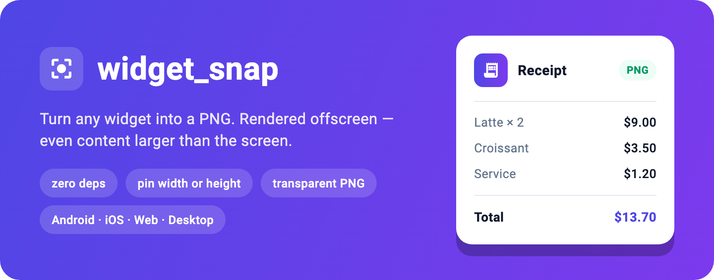
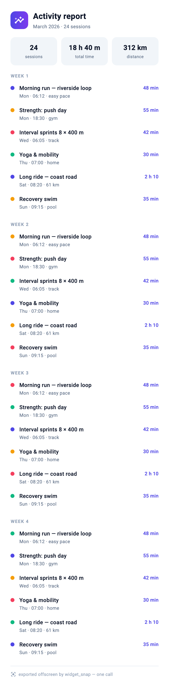

# widget_snap

[](https://pub.dev/packages/widget_snap)
[](https://pub.dev/packages/widget_snap/score)
[](https://pub.dev/packages/widget_snap/score)
[](https://github.com/Hai4320/widget_snap/actions/workflows/ci.yml)
[](https://pub.dev/packages/very_good_analysis)
[](https://github.com/Hai4320/widget_snap/blob/main/LICENSE)

<p align="center">
  
</p>

Export any Flutter widget to PNG. The widget is rendered **offscreen** — it
never has to be mounted or visible, so content taller or wider than the screen
works too.

**Zero dependencies.** It drives Flutter's own render pipeline (`BuildOwner` +
`PipelineOwner` + `RenderView`) — no `screenshot` or other third-party capture
package, no platform code. Only `flutter` itself, which is why it runs on
**Android, iOS, web, macOS, Windows, and Linux**.

## Features

- Capture any widget — mounted or not, larger than the screen or not.
- Size-driven layout: pin the width **or** the height (or both); the other axis grows to fit the content.
- Inherits your app's theme, `MediaQuery`, and text direction via `context`.
- Fails loud on build errors instead of silently exporting a blank image.
- Two-layer API: pure bytes (core) or a temp-file path (convenience).
- **No permissions required.** Bytes stay in memory; `toPngFile` writes only
  to the app-private temp dir. Saving to the gallery or sharing is your app's
  step (and its permission prompt), not this package's.

### Larger than the screen? One call.

<p align="center">
  
</p>

This report never fits a phone screen — it was captured in a single
`toPngBytes` call. In fact, **every image in this README was exported by
widget_snap itself**: see [`tool/readme_images.dart`](tool/readme_images.dart).

## Platform support

| Android | iOS | Web | macOS | Windows | Linux |
|:-:|:-:|:-:|:-:|:-:|:-:|
| ✅ | ✅ | ✅* | ✅ | ✅ | ✅ |

\* On the web, use `toPngBytes` — `toPngFile` throws `UnsupportedError`
because browsers have no writable filesystem. See [Web](#web).

## Install

```sh
flutter pub add widget_snap
```

## Usage

The API is a pair of extension methods on `Widget`:

```dart
import 'package:widget_snap/widget_snap.dart';

// Core: capture to bytes — you own the IO.
final bytes = await myWidget.toPngBytes(
  context,        // carries inherited theme/media/direction into the offscreen tree
  width: 1080,    // optional; default = current view width. Height grows to fit.
  // height: 720, // or pin the height instead, and let the width grow (wide content)
);
// upload, preview in-memory (Image.memory), custom storage ...

// Or the convenience wrapper when the next step needs a path:
final path = await myWidget.toPngFile(
  context,
  filename: 'export.png',   // written under the system temp dir
);
await SharePlus.instance.share(ShareParams(files: [XFile(path)]));
// or Gal.putImage(path), ...
```

Prefer a named entry point? The `WidgetSnap` facade mirrors both — type
`WidgetSnap.` and autocomplete shows the whole API:

```dart
final bytes = await WidgetSnap.pngBytes(myWidget, context);
final path  = await WidgetSnap.pngFile(myWidget, context, filename: 'export.png');
```

### Parameters

| Param | Required | Description |
|---|---|---|
| `context` | ✓ | Source of inherited theme, `MediaQuery`, and text direction. |
| `width` | — | Target width in logical pixels. Default = current view width (when `height` is also unset); the unpinned axis grows to fit the content. |
| `height` | — | Target height in logical pixels. Pin this for naturally-wide content (timelines, charts) and let the width grow. |
| `filename` | file variant only | Output filename (written under the system temp dir). |
| `pixelRatio` | — | Raster scale, default `2.5`. Clamped so the pinned axis × `pixelRatio` ≤ 4096. |
| `delay` | — | Wait before capture so async images (network/asset) resolve; default zero. |

`toPngBytes` returns the PNG `Uint8List`; `toPngFile` returns the written
file's path.

### Web

`toPngBytes` works as-is. There is no filesystem to write to, so instead of
`toPngFile`, hand the bytes to whatever download/share mechanism your app
uses — e.g. `share_plus`:

```dart
final bytes = await myWidget.toPngBytes(context);
await SharePlus.instance.share(ShareParams(
  files: [XFile.fromData(bytes, mimeType: 'image/png', name: 'export.png')],
));
```

## Design boundary

This package knows nothing about your app — no models, no i18n, no state
management, no share/download logic. It captures a widget to PNG and hands
the result back. **Your app owns what happens next** (share sheet, save to
gallery, upload, …).

## Notes & limits

- **No `MaterialApp` needed.** The offscreen tree wraps your widget in a white
  `Material` + `Directionality` + `MediaQuery`, so `Ink`, `InkWell`, and
  `Text` render as in-app.
- **The pinned axis is clamped, the growing one is not.** `pixelRatio` is
  reduced so the rasterized *pinned* axis stays under the ~4096px GPU texture
  cap on low-end devices. A document that grows large along the **unpinned**
  axis can still exceed the cap — if you hit clipping or OOM, lower
  `pixelRatio`.
- **No `Overlay` in the offscreen tree.** Widgets that require an `Overlay` /
  `Navigator` ancestor (`Tooltip`, dropdowns, anything that pops routes) throw
  during the offscreen build. The export fails loudly with that error instead
  of producing a blank image. Strip such widgets from the export copy of your
  content.
- **Don't reuse live `GlobalKey`s.** The offscreen tree mounts on the
  framework's `BuildOwner` (so Flutter-internal `GlobalKey`s — `Ink`, form
  fields — resolve correctly) and is unmounted right after capture. One
  consequence: don't pass content holding a `GlobalKey` that is
  *simultaneously mounted* in the live app tree (duplicate-key error in
  debug) — build a fresh copy of the widget for export instead.
- **Async images need `delay`.** `NetworkImage` / asset decodes paint blank on
  the first frame; pass a `delay` so they resolve before rasterizing.
- **Files are temporary.** `toPngFile` writes under the system temp dir,
  which the OS may clean at any time (iOS routinely does). Move the file if
  you need it to persist.
- **Flutter-version sensitive.** Uses the internal render-pipeline API
  (`ViewConfiguration.logicalConstraints`, `RenderView(view:)`). Verified on
  Flutter 3.35 and 3.41 (tests run on the VM and in Chrome). If a Flutter
  upgrade breaks capture, this is the first place to check.

## Roadmap

- JPEG output (quality knob) for photo-heavy content.
- `backgroundColor` / `theme:` overrides for the offscreen tree.
- Tiled capture for documents that exceed the GPU texture cap along the growing axis.
- PDF export (pagination, headers/footers, bookmarks) as a separate layer.
